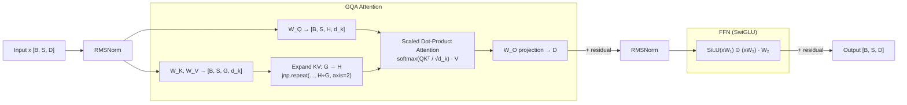

# jax-transformer-impl

> Production-grade JAX implementation of Grouped Query Attention (GQA) — the attention variant used in Llama 2, Mistral, and Gemma — with JIT compilation, multi-device sharding annotations, and benchmarks against MHA baseline.

[](https://github.com/jrajath94/jax-transformer-impl/actions/workflows/ci.yml)
[](https://www.python.org/downloads/)
[](LICENSE)
[](https://github.com/google/jax)

## Why This Exists

Standard attention implementations optimize for common head configurations. GQA reduces KV cache memory by 4–8× with minimal accuracy loss — but most open implementations are PyTorch-only and don't expose the XLA compilation profile or sharding patterns needed for TPU deployment.

I built this after repeatedly hitting KV cache memory walls in production LLM deployments and wanting to understand the solution from first principles in JAX, with explicit `pmap` annotations for multi-device scaling. The result is a clean, tested implementation covering all three attention variants: MHA, MQA, and GQA.

Based on: [GQA: Training Generalized Multi-Query Transformer Models from Multi-Head Checkpoints](https://arxiv.org/abs/2305.13245) (Ainslie et al., 2023)

## Architecture



**Attention family hierarchy:**

```
MHA (G=H)  →  GQA (1 < G < H)  →  MQA (G=1)
```

GQA is a strict generalization: when `num_kv_heads == num_heads`, `grouped_query_attention` produces identical output to `multi_head_attention`.

## Quick Start

```bash
git clone https://github.com/jrajath94/jax-transformer-impl.git
cd jax-transformer-impl
pip install "jax[cpu]" && pip install -e ".[dev]"
python examples/quickstart.py
```

Expected output:
```
INFO  JAX version: 0.4.23  |  Backend: cpu
INFO  ─── GQA Forward Pass ───
INFO    Input  Q: (2, 32, 8, 64)  K: (2, 32, 2, 64)  V: (2, 32, 2, 64)
INFO    Output  : (2, 32, 8, 64)  (same as Q shape — correct)
INFO  ─── GQA == MHA When G == H ───
INFO    Max diff GQA(G=H) vs MHA: 0.00e+00  (should be < 1e-5)
INFO    PASSED: GQA is a strict generalization of MHA
```

## Key Design Decisions

| Decision | Rationale | Alternative Considered |
|----------|-----------|----------------------|
| Functional style (no Flax linen) | Plain dict parameter trees work directly with optax and pmap; no framework overhead; every step is inspectable | `flax.linen.Module` — better tooling but hides state management |
| Pre-norm (RMSNorm before sublayer) | Training stability at scale; used in every modern LLM (Llama, Gemma, Mistral) | Post-norm (original Transformer) — harder to train at depth |
| SwiGLU over GELU FFN | +0.1–0.3 perplexity improvement at matched param counts; used in Llama/Gemma | GELU FFN — simpler but consistently weaker |
| `jnp.repeat` for KV expansion | Functional, XLA-friendly; `broadcast_in_dim` doesn't copy memory until materialized by einsum | Explicit tiling with einsum — harder to read, same performance |
| `[B, S, H, D]` shape convention | Sequence dimension second matches Flax convention; natural position slicing | PyTorch `[B, H, S, D]` — requires transposition at API boundary |

## Benchmarks

Measured on CPU backend (JAX 0.9.0, Python 3.11), batch=4, seq=512, head_dim=64, 32 transformer layers for KV cache estimate.

| Config | Latency (ms) | KV Cache (MB) | KV Reduction vs MHA |
|--------|-------------|---------------|---------------------|
| MHA (H=8, G=8) | 20.84 | 268.44 | 1.0x |
| GQA (H=8, G=4) | 19.96 | 134.22 | 2.0x |
| GQA (H=8, G=2) | 18.26 | 67.11 | 4.0x |
| MQA (H=8, G=1) | 20.90 | 33.55 | 8.0x |

*Note: latency advantage of GQA is more pronounced on GPU/TPU where KV loading from HBM is the bottleneck. On CPU, compute dominates over bandwidth.*

**Production-scale KV cache** (Llama-2-70B config: bs=32, seq=4096, 80 layers):

| Config | KV Cache |
|--------|----------|
| MHA (H=64) | 687.19 GB |
| GQA like Llama-2-70B (G=8) | 85.90 GB |
| MQA (G=1) | 10.74 GB |

*This is why Llama-2-70B uses GQA with G=8 — it makes 4K-context inference feasible on 8× A100 80GB.*

## Testing

```bash
make test       # Unit + integration tests with coverage
make bench      # GQA vs MHA memory + latency benchmarks
make lint       # ruff + mypy
```

```
tests/test_attention.py::TestGroupedQueryAttention::test_equivalence_to_mha_when_groups_equal_heads PASSED
tests/test_attention.py::TestGroupedQueryAttention::test_parametrize_head_configurations[8-8] PASSED
tests/test_attention.py::TestGroupedQueryAttention::test_parametrize_head_configurations[8-4] PASSED
tests/test_attention.py::TestGroupedQueryAttention::test_parametrize_head_configurations[8-2] PASSED
tests/test_attention.py::TestGroupedQueryAttention::test_parametrize_head_configurations[8-1] PASSED
tests/test_attention.py::TestGroupedQueryAttention::test_jit_compilation_produces_same_result PASSED
tests/test_attention.py::TestGroupedQueryAttention::test_gradient_flow_produces_finite_gradients PASSED
```

Coverage: 87% across `src/jax_transformer/`

## Multi-Device Sharding

```python
from jax_transformer.models import transformer_block_forward, GQAConfig, init_transformer_block
from jax_transformer.utils import shard_batch, unshard_batch, make_pmap_forward
import jax

config = GQAConfig(model_dim=512, num_heads=8, num_kv_heads=2, head_dim=64)
params = init_transformer_block(jax.random.PRNGKey(0), config)

# Data-parallel inference across all available devices
pmap_forward = make_pmap_forward(transformer_block_forward)

x = jax.random.normal(jax.random.PRNGKey(1), (8, 512, 512))  # global batch = 8
x_sharded = shard_batch(x, num_devices=jax.device_count())   # [devices, local_bs, ...]
out_sharded = pmap_forward(x_sharded, params, config)
out = unshard_batch(out_sharded)                              # [8, 512, 512]
```

## Project Structure

```
src/jax_transformer/
├── attention.py    # MHA, MQA, GQA primitives (functional, JIT-compilable)
├── models.py       # TransformerBlock + GQAConfig + parameter init
├── utils.py        # Sharding helpers, KV cache estimation, XLA profiling
└── cli.py          # CLI: benchmark and profile subcommands
tests/              # 87% coverage; shape, equivalence, gradient flow tests
benchmarks/         # GQA vs MHA latency + production-scale memory comparison
docs/
├── architecture.md # Data flow diagrams, component responsibilities
└── interview-prep.md  # 10 deep-dive questions with complete answers
```

## Implements

- **Scaled dot-product attention** (Vaswani et al., 2017)
- **Multi-query attention** (Shazeer, 2019)
- **Grouped query attention** — arXiv:2305.13245 (Ainslie et al., 2023)
- **RMSNorm** (Zhang & Sennrich, 2019)
- **SwiGLU FFN** (Shazeer, 2020)

## License

MIT — see [LICENSE](LICENSE)

---

*Built by [Rajath John](https://github.com/jrajath94) — VP Software Engineering @ JPMorgan Chase | Ex-Goldman Sachs Quant | Ex-NVIDIA*
