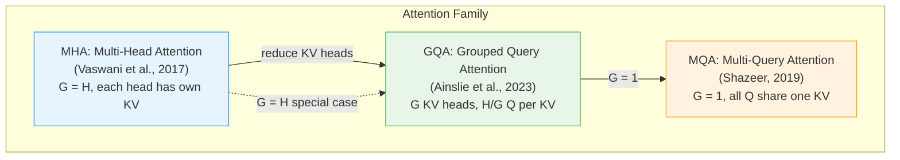
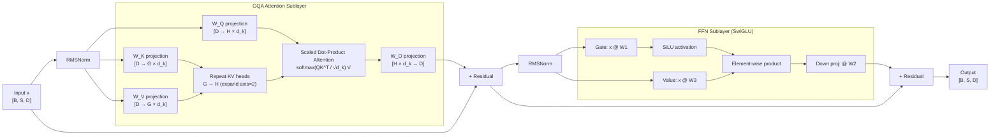

# Architecture: jax-transformer-impl

## Overview

This project implements Grouped Query Attention (GQA) and its variants (MHA, MQA) as a production-grade JAX library. The architecture is deliberately functional — no classes hold mutable state, every function is JIT-compilable, and parameter trees are plain Python dicts compatible with optax optimizers and pmap multi-device training.

## Attention Variants



## Data Flow



## Module Structure

```
src/jax_transformer/
├── attention.py      # Core attention primitives (functional)
│   ├── scaled_dot_product_attention()   # shared by all variants
│   ├── multi_head_attention()           # standard MHA
│   ├── multi_query_attention()          # MQA (G=1)
│   └── grouped_query_attention()        # GQA (G≤H)
│
├── models.py         # Higher-level model components
│   ├── GQAConfig (dataclass)            # typed config, validated at init
│   ├── init_transformer_block()         # Kaiming-init parameter tree
│   ├── rms_norm()                       # Root Mean Square LayerNorm
│   ├── swiglu_ffn()                     # SwiGLU gated FFN
│   ├── attention_forward()              # attention with QKV projections
│   ├── transformer_block_forward()      # full block (attn + FFN + residuals)
│   └── TransformerBlock (class wrapper) # OOP interface over functional core
│
├── utils.py          # Multi-device and profiling utilities
│   ├── make_causal_mask()               # autoregressive attention mask
│   ├── shard_batch() / unshard_batch()  # pmap helpers
│   ├── kv_cache_memory_bytes()          # KV cache cost estimation
│   ├── xla_compilation_profile()        # log XLA primitive statistics
│   └── make_pmap_forward()              # wrap function for multi-device
│
└── cli.py            # CLI for benchmarking and profiling
    ├── benchmark subcommand             # GQA vs MHA latency + memory
    └── profile subcommand               # XLA profile + param count
```

## Multi-Device Execution Pattern

pmap distributes inputs across devices along axis 0. Parameters are broadcast (replicated) to every device. This is standard data-parallel training.

```
Input [8, 512, 512]                    8 = global_batch
        │
        ▼  shard_batch(num_devices=4)
       [4, 2, 512, 512]                4 devices, local_batch=2
        │
        ▼  pmap(transformer_block_forward, in_axes=(0, None, None))
  ┌─────┴──────────────────────────────────────┐
  │  device 0    device 1    device 2    device 3  │
  │  batch[0:2]  batch[2:4]  batch[4:6]  batch[6:8]│
  │  params      params      params      params     │
  └─────┬──────────────────────────────────────┘
        │
        ▼  unshard_batch()
Output [8, 512, 512]
```

## KV Cache Memory Analysis

The key insight from the GQA paper: at inference time, the KV cache — not model weights — is often the binding memory constraint.

| Config | KV heads | KV cache (bs=8, seq=2048, 32 layers) |
|--------|----------|--------------------------------------|
| MHA H=32 | 32 | ~268 MB (fp32) |
| GQA G=8  | 8  | ~67 MB — 4x reduction |
| GQA G=4  | 4  | ~33 MB — 8x reduction |
| MQA G=1  | 1  | ~8.4 MB — 32x reduction |

The 4x reduction (H=32, G=8) is the Llama-2-70B configuration. Quality is nearly indistinguishable from MHA on most benchmarks; see Ainslie et al. (2023) Table 3.

## XLA Compilation Notes

Key ops visible in `jax.make_jaxpr`:
- `dot_general`: fused einsum operations — the primary computation
- `reduce_max`, `exp`, `reduce_sum`, `div`: softmax decomposed by XLA
- `broadcast_in_dim`: KV head expansion (repeat_interleave)
- `slice`, `reshape`: head reshaping ops

XLA typically fuses the softmax reduction and the QK^T matmul into a single kernel. The `broadcast_in_dim` for KV expansion is lightweight — no data is actually copied until the attention computation materializes it.
